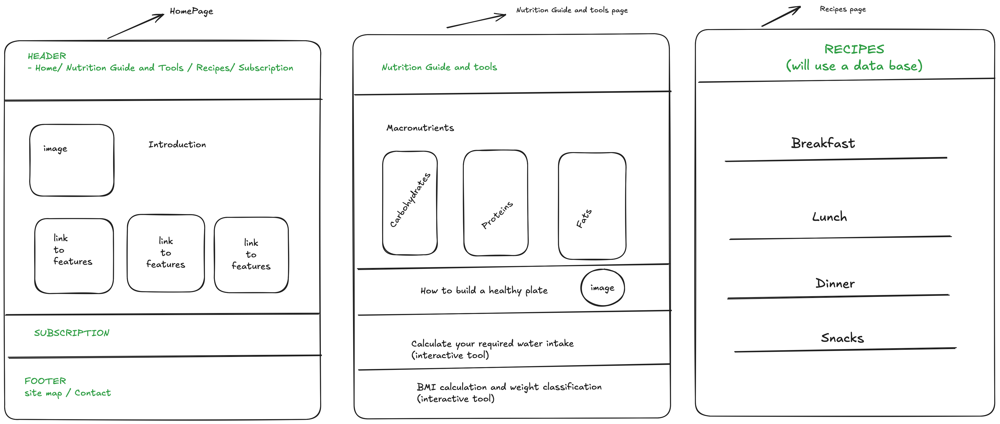

# MyNutri

> MyNutri is a website to help people improve their eating habits towards nutrition information.

## Table of Contents

- [General Info](#general-information)
- [Wireframe](#wireframe)
- [Getting started](#getting-started)

## General Information

> The main goal of "MyNutri" is to provide reliable nutrition guidance for individuals with chronic conditions such as obesity, high blood pressure, and diabetes. It aims to support those who lack access to a dietitian or nutritionist but need to improve their health and manage their conditions effectively.

### Preview of content

- What are macronutrients and their functions in the body
- How to build a healthy plate
- Calculate water intake
- Calculate BMI and have classification + weight goal
- Daily menu recipes

## Wireframe



## Getting started

To get a local copy up and running follow these steps:

1. Clone the repo

    ```sh
    git clone git@github.com:marcellaziroldo/mynutri.git
    ```

1. Change directory

    ```sh
    cd mynutri
    ```

1. Change branch

    ```sh
    git checkout develop
    ```

1. NPM Install

    ```sh
    npm install
    ```

1. Run local server

    ```sh
    npm run dev
    ```

## Future Improvements

### Planned roadmap:

- Create basic Homepage Layout - DONE
- Create Nutrition Guide and Tools Page. In this page the user will have some interactivity such as calculate water intake -DONE
- Create a recipes pages using API. - DONE
- Create a subscription page. - IN PROGRESS
- Merge content to REACT - IN PROGRESS